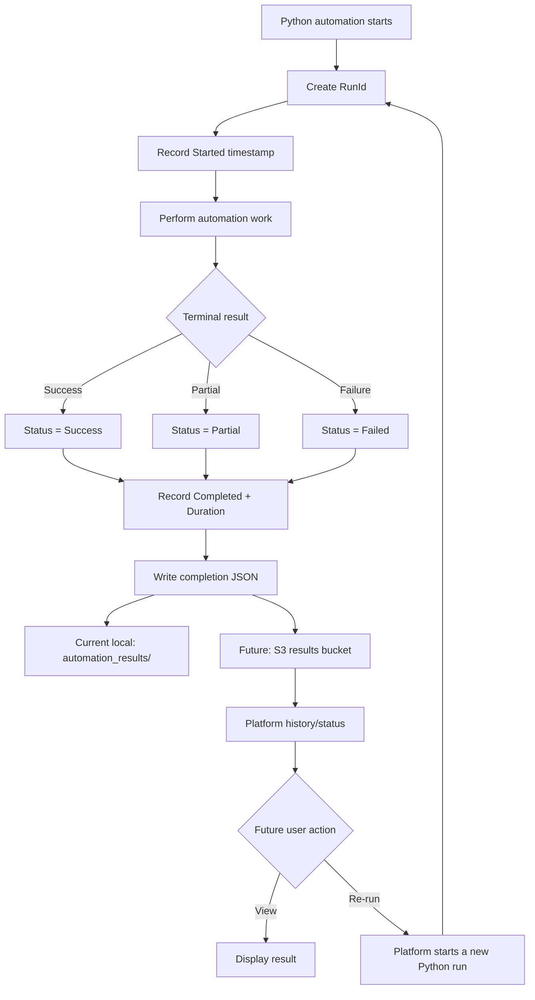

# Automation Lifecycle



## Contract boundary

```text
                 Python automation
                        |
                        | implementation-specific
                        v
                 +--------------+
                 | automation   |
                 | business     |
                 | logic        |
                 +--------------+
                        |
                        | standardized
                        v
              +----------------------+
              | completion JSON      |
              | Name                 |
              | Status               |
              | Lastrun              |
              | RunId                |
              | Started / Completed  |
              | Duration             |
              | additional fields   |
              +----------------------+
                        |
          +-------------+-------------+
          |                           |
          v                           v
   Local filesystem                 S3
   today                            future
```
