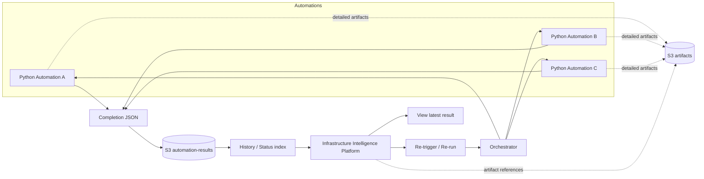

# Future Automation Platform Architecture



## Separation of concerns

```text
+-----------------------+      +----------------------+      +--------------------+
| Python automation     | ---> | Completion contract  | ---> | Platform           |
|                       |      |                      |      |                    |
| AWS/Wiz/Palo/etc.     |      | JSON result          |      | status             |
| business logic        |      | standard fields      |      | history            |
| API calls             |      | extension fields    |      | UI                 |
| calculations          |      | run metadata         |      | re-run             |
+-----------------------+      +----------------------+      +--------------------+
```
