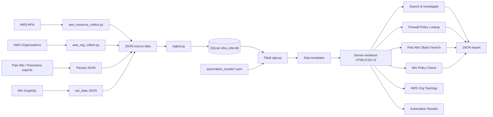

# Infrastructure Intelligence Architecture

## High-level architecture



## Layering

```text
+--------------------------------------------------------------+
| Presentation                                                 |
| Flask routes + Jinja templates + CSS                         |
+--------------------------------------------------------------+
| Search / correlation                                         |
| app.py                                                       |
+--------------------------------------------------------------+
| Data access / indexing                                       |
| database.py + SQLite                                         |
+--------------------------------------------------------------+
| Ingestion                                                    |
| ingest.py                                                    |
+--------------------------------------------------------------+
| Collection / source preparation                               |
| AWS collectors + Panorama/Palo parsing + Wiz exports         |
+--------------------------------------------------------------+
```

The important boundary is that `app.py` should not need to make a fresh AWS/Panorama/Wiz API call for every interactive search. Collection and ingestion prepare a searchable local model first.
